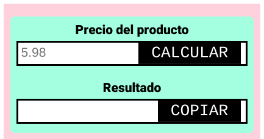

<h1 style="border-bottom: none">
    <b><a href="https://github.com/jospaquim/IGV-Helper-Chrome-Extension">IGV Helper - Chrome Extension</a></b>
</h1>

Esta extensión para Chrome te ayuda a calcular el precio de tus productos sin incluir el IGV (Impuesto General a las Ventas), lo cual es útil para el registro correcto de ventas ante la SUNAT.Además, cuenta con una función adicional para generar nombres y apellidos aleatorios.

## Descripción

En Perú, el IGV es un impuesto del 18% que se aplica a la venta de bienes y servicios. Sin embargo, en el sistema de la SUNAT, el precio de venta se registra incluyendo automáticamente el IGV. Esta extensión permite ingresar el precio de venta con IGV y obtener el precio neto sin IGV, facilitando el registro preciso de las ventas.

Adicionalmente, la extensión incluye una función para generar nombres y apellidos aleatorios, lo cual puede ser útil en diversos escenarios, como pruebas de software, generación de datos ficticios, etc.

## Características

### Cálculo de precio sin IGV
- Ingreso del precio de venta con IGV mediante un campo de entrada
- Cálculo automático del precio neto sin IGV
- Visualización del precio neto sin IGV en un campo de salida
- Interfaz sencilla e intuitiva

### Generador de nombres y apellidos
- Generación aleatoria de nombres y apellidos
- Opción para generar un solo nombre o un conjunto de nombres
- Visualización de los nombres generados en un área de texto

## Instalación

1. Descarga el código fuente de este repositorio o clona el repositorio en tu máquina local.
2. En Google Chrome, abre la página de extensiones (`chrome://extensions/`).
3. Activa el "Modo de desarrollador" en la esquina superior derecha.
4. Haz clic en "Cargar descomprimida" y selecciona la carpeta del repositorio clonado.
5. La extensión IGV-Chrome-Extension se ha instalado correctamente.

## Uso

### Cálculo de precio sin IGV
1. Después de instalar la extensión, aparecerá un nuevo icono en la barra de herramientas de Chrome.
2. Haz clic en el icono para abrir la interfaz de la extensión.
3. Ingresa el precio de venta con IGV en el campo de entrada correspondiente y luego presionar en CALCULAR.
4. El precio neto sin IGV se mostrará automáticamente en el campo de salida.
5. Utiliza este precio neto para registrar correctamente la venta en el sistema de la SUNAT.

### Generador de nombres y apellidos
1. En la interfaz de la extensión, accede a la sección del generador de nombres y apellidos.
3. Los apellidos y nombres aleatorios se generan automaticamente en ese orden.
4. Los nombres generados se mostrarán en el área de texto designada.

## Contribución

Si deseas contribuir a este proyecto, ¡eres bienvenido! Puedes abrir issues para reportar problemas o enviar pull requests con mejoras o nuevas características.

## Licencia

Este proyecto está licenciado bajo la [Licencia MIT](LICENSE).
